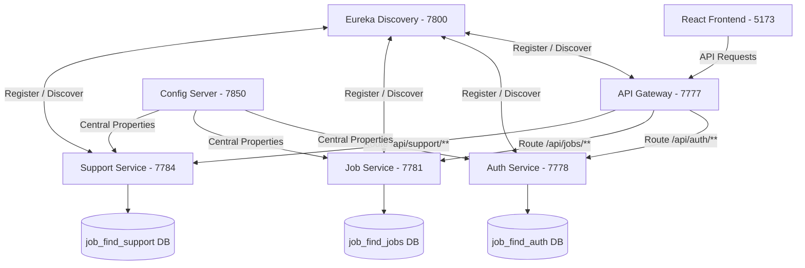

# Job Portal - Microservices Application

A high-performance, modern Job Finding Platform built using **Vite React (Frontend)** and a **Spring Boot Multi-Module Microservices Architecture (Backend)**.

---

## 🏗️ System Architecture

The project consists of 6 backend services and a React frontend, organized as a Maven Multi-Module project:



---

## 🚦 Port & Service Mapping

| Service Name | Port | Description |
| :--- | :---: | :--- |
| **Eureka Server** | `7800` | Service Registration & Discovery dashboard |
| **Config Server** | `7850` | Centralized properties management (Native file-system profile) |
| **API Gateway** | `7777` | Single entry point with CORS policies and JWT authentication verification |
| **Auth Service** | `7778` | User registration, login, and profile management (`job_find_auth` DB) |
| **Job Service** | `7781` | Job postings, applications, and candidate tracking (`job_find_jobs` DB) |
| **Support Service**| `7784` | Email notifications, invoice generation, dashboard analytics (`job_find_support` DB) |
| **React Frontend** | `5173` | Premium Glassmorphic / Dark-themed frontend client |

---

## 🛠️ Requirements & Setup

### Prerequisites
* Java **17** or higher
* Node.js **18+** & npm
* MySQL Server (listening on `localhost:3306`)

### 1. Database Initialization
Create the three required schemas in your MySQL server:
```sql
CREATE DATABASE job_find_auth;
CREATE DATABASE job_find_jobs;
CREATE DATABASE job_find_support;
```

---

## 🚀 How to Run the Application

Always start the services in the following order:

### Step 1: Start Eureka Discovery Server
```bash
# From root directory
./mvnw spring-boot:run -pl eureka-server
```
*Verify Dashboard at:* [http://localhost:7800](http://localhost:7800)

### Step 2: Start Config Server
```bash
./mvnw spring-boot:run -pl config-server
```

### Step 3: Start API Gateway
```bash
./mvnw spring-boot:run -pl api-gateway
```

### Step 4: Start Business Microservices (Auth, Job, Support)
Run each in a separate terminal:
```bash
./mvnw spring-boot:run -pl auth-service
./mvnw spring-boot:run -pl job-service
./mvnw spring-boot:run -pl support-service
```

### Step 5: Run the Frontend
```bash
cd frontend
npm install
npm run dev
```
*Verify client at:* [http://localhost:5173](http://localhost:5173)

---

## 🔒 Security Configuration
* **JWT Signature Algorithm:** HMAC using `HS512` (SHA-512).
* **Secret Key:** Centralized inside `api-gateway` and `auth-service` property configs.
* **Filter Security:** API Gateway validates JWT tokens globally on all endpoints, excluding public authentication paths (`/api/auth/**`).
